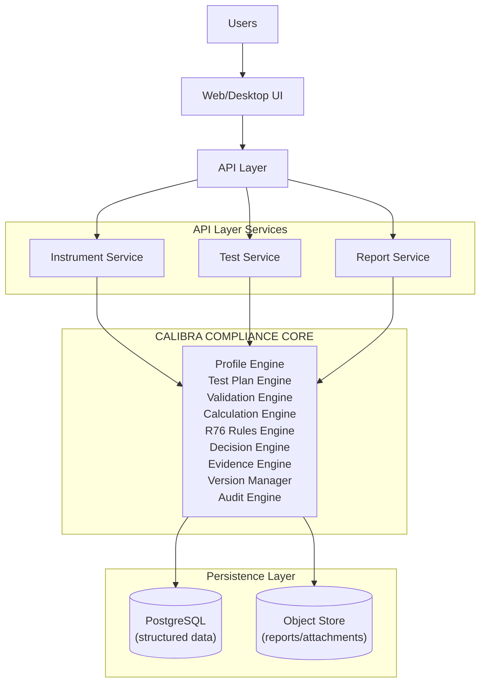
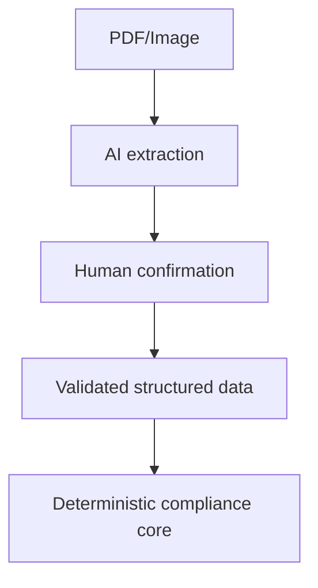

# CALIBRA — System Architecture

## Goal
Keep the application workflow stable while standards and jurisdiction-specific requirements can change independently.

**Core principle:** UI != compliance logic.

## High-level architecture


## Optional AI path

*AI must not independently decide legal compliance.*

## Suggested stack
- **Frontend**: React, TypeScript, Vite/Next.js, Tailwind CSS, React Hook Form, Zod
- **Backend**: Python, FastAPI, Pydantic, SQLAlchemy, Alembic
- **Data**: PostgreSQL (full-text search initially, pgvector only if semantic search is needed)
- **Reporting**: ReportLab or controlled HTML-to-PDF, docxtpl for DOCX
- **Testing**: pytest, Playwright, frontend unit tests
- **Deployment**: Docker, reverse proxy, PostgreSQL, object storage

## Core entities
- **Instrument**: id, manufacturer, model, instrument_type, accuracy_class, min_capacity, max_capacity, verification_interval_e, number_of_intervals, configuration_json, status, timestamps
- **TestSession**: id, instrument_id, ruleset_id, started_by, reviewer_id, status, started_at, completed_at
- **TestDefinition**: id, code, name, description, category, applicability_rule_id, input_schema, calculation_rule_id, decision_rule_id
- **Observation**: id, test_session_id, test_definition_id, raw_value, raw_unit, normalized_value, normalized_unit, source, sequence_no, metadata_json, created_at
- **TestResult**: id, test_session_id, test_definition_id, status, calculated_values_json, decision_reason, ruleset_id, evidence_id
- **RuleSet**: id, standard, edition, version, effective_from, effective_to, status, checksum, source_reference
- **Rule**: id, ruleset_id, code, name, conditions_json, formula_definition, decision_definition, references_json
- **Evidence**: id, result_id, input_snapshot_json, normalization_json, calculation_trace_json, rule_snapshot_json, decision_snapshot_json, created_at
- **AuditEvent**: id, actor_id, action, entity_type, entity_id, timestamp, before_json, after_json, metadata

## Services
- **Instrument Service**: CRUD, profile validation, instrument history.
- **Test Plan Service**: Applicability evaluation, ordering, required/conditional/not-applicable statuses.
- **Validation Service**: Fields, types, ranges, units, cross-field consistency, stale/duplicate warnings.
- **Calculation Service**: Pure calculations, unit normalization, calculation trace, raw-input preservation.
- **R76 Rule Service**: Ruleset loading, condition evaluation, rule explanation, source/version metadata.
- **Decision Service**: PASS/FAIL/REVIEW/NOT_APPLICABLE policy and safe decision behavior.
- **Evidence Service**: Input→calculation→rule→decision lineage and evidence retrieval.
- **Report Service**: Report mapping, PDF/DOCX generation, report metadata.

## Rules-as-data example
```json
{
  "code": "MPE.EXAMPLE",
  "when": {
    "accuracy_class": "III"
  },
  "decision": {
    "type": "absolute_error_lte",
    "limit": "1 * e"
  }
}
```
*The exact rule contents must be verified against the authoritative R76 edition.*

## API sketch
- `POST /api/instruments`
- `GET /api/instruments/{id}`
- `POST /api/instruments/{id}/validate`
- `POST /api/instruments/{id}/generate-test-plan`
- `POST /api/sessions`
- `POST /api/sessions/{id}/observations`
- `POST /api/sessions/{id}/validate`
- `POST /api/sessions/{id}/calculate`
- `POST /api/sessions/{id}/evaluate`
- `GET /api/results/{id}/evidence`
- `POST /api/sessions/{id}/report`
- `GET /api/reports/{id}`
- `GET/POST /api/rulesets`
- `GET/POST /api/users`
- `GET /api/audit-events`

## Security
- **Roles**: TECHNICIAN, REVIEWER, ADMIN, AUDITOR
- **Controls**: authentication, server-side authorization, encrypted transport, secure storage where appropriate, audit events, least privilege
- **Tamper-evident evidence**: For finalized results: serialize evidence deterministically, hash it, store checksum, store ruleset checksum/version, store report checksum, record finalization event

## Extension
```
CALIBRA CORE
  |
  +-- R76 Module
  +-- R49 Module (future)
  +-- R46 Module (future)
  +-- R60 Module (future)
  |
  +-- Jurisdiction overlays
```
*The SIH MVP should implement only the R76 scope that has been validated.*
