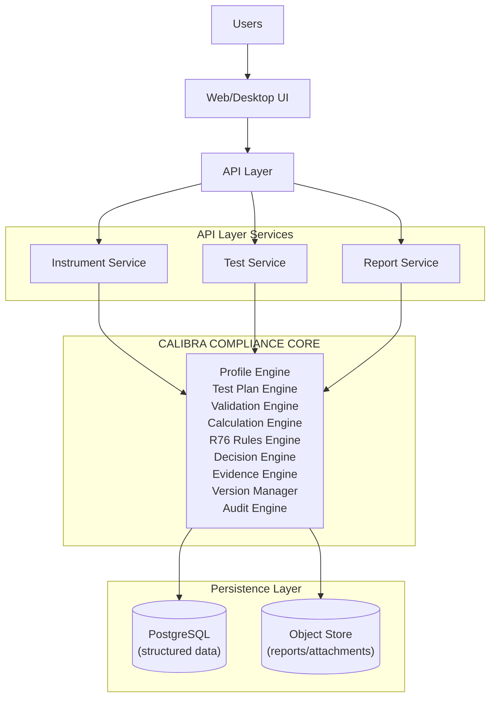

# CALIBRA — Explainable Metrology Compliance Engine

CALIBRA is a fully integrated, explainable compliance engine for Legal Metrology / Non-Automatic Weighing Instruments (NAWI) based on OIML R76.

**SIH Problem Statement:** SIH26035  
**Core Principles:** AUTOMATE. EXPLAIN. PROVE.

## Overview
CALIBRA converts instrument profiles into an applicable test plan, validates raw observations, runs deterministic calculations, and evaluates them against explicitly defined R76 rules to generate an evidence-backed standardized test report.

*The differentiator is the explainable compliance engine, not just PDF generation.*

## Features
- **Deterministic Compliance**: AI may assist in data entry, but all legal decisions are derived from an explicit rules engine.
- **Explainability First**: Every test result exposes the exact path: Source Input → Normalization → Calculation → Applicable Rule → Threshold → Result.
- **Tamper-Evident Evidence**: Preserves the original raw observations and an immutable audit trail of the calculations.

## Architecture



For deeper architectural details, see [02_SYSTEM_ARCHITECTURE.md](02_SYSTEM_ARCHITECTURE.md).

## Getting Started

CALIBRA is built with a React/Vite frontend and a Python/FastAPI backend.

### 1. Backend Setup
```bash
cd backend
python -m venv venv
# On Windows: venv\Scripts\activate
# On Unix: source venv/bin/activate
pip install fastapi uvicorn sqlalchemy reportlab
python seed.py # Seeds the SQLite database with demo data
uvicorn main:app --reload
```

### 2. Frontend Setup
```bash
cd frontend
npm install
npm run dev
```

Navigate to `http://localhost:5173` to access the application dashboard.
