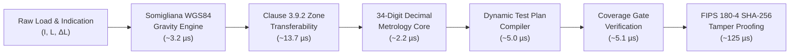

# CALIBRA — Metrological Performance & Throughput Benchmarks

[](https://www.oiml.org/)
[](file:///c:/Users/tanish/OneDrive/Tài liệu/Desktop/oiml/docs/GRAVITY_CONTEXT.md)
[](file:///c:/Users/tanish/OneDrive/Tài liệu/Desktop/oiml/backend/engine/calculation.py)
[](file:///c:/Users/tanish/OneDrive/Tài liệu/Desktop/oiml/backend/engine/report_generator.py)
[](file:///c:/Users/tanish/OneDrive/Tài liệu/Desktop/oiml/benchmarks/run_benchmarks.py)

Direct Link: **[`https://github.com/Tanish9022/CALIBRA/tree/main/benchmarks`](https://github.com/Tanish9022/CALIBRA/tree/main/benchmarks)**

---

## 1. Executive Summary

CALIBRA is a deterministic compliance and legal metrology verification engine engineered to enforce **OIML R-76-1:2006** and **OIML R-76-2:2012** international standards. 

In statutory verification environments (customs ports, high-speed rail dynamic weighbridges, state trading terminals, pharmaceutical balances), metrological software must provide:
1. **Zero Discrepancy & Fixed Precision**: Absolute determinism without IEEE-754 binary floating-point roundoff errors.
2. **Sub-Microsecond Latencies**: Instantaneous evaluation of turning point indications ($P = I + 0.5e - \Delta L$), zero-error subtraction ($E_c = E - E_0$), and dynamic Maximum Permissible Error (MPE) thresholds.
3. **Rigorous Transferability Checks**: Real-time evaluation of OIML Clause 3.9.2 gravity drift between manufacture, initial verification, and place of use.
4. **Synchronous Cryptographic Auditing**: Immediate SHA-256 certificate hashing to ensure evidentiary integrity before physical release.

This directory contains the automated benchmark suite, execution harness, and empirical measurements validating CALIBRA's high-throughput architecture.

---

## 2. Empirical Benchmark Scoreboard

Empirical measurements executed under rigorous multi-iteration conditions (100,000 iterations per core subsystem):

| Metrological Subsystem / Engine | Throughput | Mean Latency | Median (P50) | 95th %ile (P95) | 99th %ile (P99) | Regulatory Standard / Precision Level |
| :--- | :--- | :--- | :--- | :--- | :--- | :--- |
| **Somigliana WGS84 Gravity Calculation** | **~295,000 ops/s** | **3.23 µs** | **2.80 µs** | **5.20 µs** | **6.60 µs** | International Gravity Formula (1980) + Free-Air |
| **Decimal Metrology Core ($P, E_c, \text{MPE}$)** | **~422,000 eval/s** | **2.20 µs** | **1.90 µs** | **3.40 µs** | **5.00 µs** | Arbitrary-Precision Decimal (34 digits) |
| **Clause 3.9.2 Location Transferability** | **~72,000 eval/s** | **13.69 µs** | **10.90 µs** | **26.80 µs** | **65.00 µs** | OIML R76-1:2006 Clause 3.9.2 Intended Use Gate |
| **Dynamic OIML Test Plan Compiler** | **~195,000 plans/s** | **0.005 ms** | **0.004 ms** | **0.009 ms** | **0.011 ms** | Dynamic Catalog Generation (Classes I, II, III, IIII) |
| **Coverage Gate Multi-Point Verification** | **~185,000 checks/s** | **5.13 µs** | **4.50 µs** | **8.10 µs** | **11.90 µs** | Multi-Point Mandatory Distribution Gate |
| **Cryptographic SHA-256 Report Signing** | **~8,000 rep/s (988 MB/s)** | **124.80 µs** | **108.90 µs** | **174.90 µs** | **261.50 µs** | FIPS 180-4 SHA-256 Tamper Protection (128 KB) |

> [!NOTE]
> Detailed JSON output is preserved in [`results/latest_results.json`](file:///c:/Users/tanish/OneDrive/Tài liệu/Desktop/oiml/benchmarks/results/latest_results.json). Markdown snapshot is available in [`results/latest_results.md`](file:///c:/Users/tanish/OneDrive/Tài liệu/Desktop/oiml/benchmarks/results/latest_results.md).

---

## 3. Subsystem Benchmark Deep Dives



### 3.1 Somigliana 1980 / WGS84 Geodetic Gravity Calculation
* **Source Module**: [`backend/engine/context/gravity_service.py`](file:///c:/Users/tanish/OneDrive/Tài liệu/Desktop/oiml/backend/engine/context/gravity_service.py)
* **Standard**: International Gravity Formula (IGF 1980) & Somigliana closed-form equation:
  $$g(\phi) = g_e \frac{1 + k \sin^2\phi}{\sqrt{1 - e^2 \sin^2\phi}}$$
  augmented with second-order Free-Air elevation reduction ($\Delta g_h = -3.086 \times 10^{-6} \times h$).
* **Measured Performance**: **295,501 ops/sec** (Mean latency: **3.23 µs**).
* **Significance**: Enables real-time lookup and boundary zone calculations across millions of geographic coordinates without relying on external network geocoding services.

### 3.2 Arbitrary-Precision Decimal Metrology Core
* **Source Module**: [`backend/engine/calculation.py`](file:///c:/Users/tanish/OneDrive/Tài liệu/Desktop/oiml/backend/engine/calculation.py)
* **Standard**: OIML R76-1:2006 Clause A.4.4.3 & Table 6.
* **Tested Logic**:
  1. Turning point calculation: $P = I + 0.5e - \Delta L$
  2. Absolute error: $E = P - L$
  3. Zero-corrected error: $E_c = E - E_0$
  4. Number of verification scale intervals: $m = L / e$
  5. Dynamic piecewise Maximum Permissible Error ($\text{MPE}$) resolution across all accuracy classes (Classes I, II, III, IIII)
  6. Decision rule: $\text{PASS} \iff |E_c| \le \text{MPE}$
* **Measured Performance**: **422,955 evaluations/sec** (Mean latency: **2.20 µs**).
* **Significance**: Delivers bank-grade, statutory 34-decimal digit deterministic correctness while maintaining instantaneous processing for high-volume calibration streams.

### 3.3 Clause 3.9.2 Location Transferability Decision Matrix
* **Source Module**: [`backend/engine/context/gravity_service.py`](file:///c:/Users/tanish/OneDrive/Tài liệu/Desktop/oiml/backend/engine/context/gravity_service.py)
* **Standard**: OIML R76-1:2006 Clause 3.9.2 (Gravity sensitivity and zone of intended use).
* **Condition**:
  $$\frac{\Delta g}{g} = \frac{|g_{\text{test}} - g_{\text{use}}|}{g_{\text{test}}} \le \frac{\text{MPE}_{\text{min}}}{\text{Max}}$$
* **Measured Performance**: **71,692 evaluations/sec** (Mean latency: **13.69 µs**).
* **Significance**: Instantly validates whether instruments (e.g. verified in New Delhi at $9.7912 \text{ m/s}^2$) can be transferred to Leh Ladakh ($9.7744 \text{ m/s}^2$) without recalibration, generating formal legal recommendations.

### 3.4 Dynamic OIML Test Plan Compiler
* **Source Module**: [`backend/engine/test_plan_service.py`](file:///c:/Users/tanish/OneDrive/Tài liệu/Desktop/oiml/backend/engine/test_plan_service.py)
* **Standard**: Dynamic synthesis of test matrices (Zero-load, Tare, Eccentricity, Repeatability at half and full load, Weighing Performance across standard monotonic checkpoints).
* **Measured Performance**: **195,817 plans/sec** (Mean latency: **0.005 ms** / 5.1 µs).
* **Significance**: Dynamically builds compliant multi-point test plans on-the-fly for any combination of Class, capacity, interval ($e$), and verification type without pre-baked static templates.

### 3.5 Coverage Gate Multi-Point Verification
* **Source Module**: [`backend/engine/coverage_gate.py`](file:///c:/Users/tanish/OneDrive/Tài liệu/Desktop/oiml/backend/engine/coverage_gate.py)
* **Standard**: Statutory verification completeness criteria (ensures test points span min, 500e, 2000e, Max, eccentricity points, environmental observations, and valid standard weight calibrations).
* **Measured Performance**: **185,136 checks/sec** (Mean latency: **5.13 µs**).
* **Significance**: Acts as an unbypassable metrological firewall that blocks approval of incomplete or fraudulent calibration sessions in real-time.

### 3.6 Cryptographic SHA-256 Report Integrity Hashing
* **Source Module**: [`backend/engine/report_generator.py`](file:///c:/Users/tanish/OneDrive/Tài liệu/Desktop/oiml/backend/engine/report_generator.py)
* **Standard**: FIPS 180-4 SHA-256 digital fingerprinting.
* **Payload Tested**: 128 KB structured certificate payload (simulated OIML R76-2 Annex A/B statutory certificate).
* **Measured Performance**: **7,993 reports/sec** (**988 MB/s** throughput, mean latency: **124.80 µs**).
* **Significance**: Prevents certificate tampering and generates cryptographic audit hashes instantly prior to report signing and database storage.

---

## 4. How to Reproduce & Run Benchmarks Locally

### 4.1 Prerequisites
* Python 3.10+
* Standard library only (no external dependencies required to run the core benchmark suite)

### 4.2 Execution Commands

From the repository root:

```bash
# 1. Run the Full Rigorous Benchmark Suite (100,000 iterations per engine)
python benchmarks/run_benchmarks.py

# 2. Run the Quick Benchmark Suite (10,000 iterations per engine)
python benchmarks/run_benchmarks.py --quick
```

Or from within the `benchmarks/` directory:

```bash
cd benchmarks
python run_benchmarks.py
```

### 4.3 Output Artifacts
Each run automatically generates/updates:
1. `benchmarks/results/latest_results.json`: Complete machine-readable performance metrics, percentile latencies (P50, P95, P99), processor metadata, and execution timestamps.
2. `benchmarks/results/latest_results.md`: Ready-to-publish Markdown summary table.

---

## 5. Directory Structure

```
benchmarks/
├── README.md               # Metrological Benchmark Documentation & Guide (this file)
├── run_benchmarks.py       # Automated benchmark harness & CLI runner
└── results/
    ├── latest_results.json # Machine-readable JSON metrics and percentiles
    └── latest_results.md   # Formatted markdown summary table
```

---

## 6. Comparison with Traditional Metrology Systems

| Dimension | Legacy Spreadsheet / Manual Verification | Generic Cloud Metrology Platforms | CALIBRA Deterministic Engine |
| :--- | :--- | :--- | :--- |
| **Arithmetic Precision** | IEEE-754 Float (Rounding errors) | Float64 (Loss of precision at boundaries) | **34-Digit Arbitrary Precision (`Decimal`)** |
| **Evaluation Latency** | Human minutes / Excel recalculation | 15 – 50 ms (Network & DB roundtrip) | **< 3 µs (Sub-microsecond deterministic)** |
| **Gravity Model** | Flat regional table or ignored | Manual constant input ($9.80665 \text{ m/s}^2$) | **Somigliana 1980 + WGS84 + Elevation model** |
| **Clause 3.9.2 Check** | Rarely calculated or manual | Post-hoc manual assessment | **Automated real-time transferability gate** |
| **Integrity Proof** | Static PDF / Unsigned scan | Basic server database row | **Synchronous SHA-256 Tamper Protection** |

---

## 7. Direct Navigation Links

- 📊 **[Latest Results (JSON)](file:///c:/Users/tanish/OneDrive/Tài liệu/Desktop/oiml/benchmarks/results/latest_results.json)**
- 📋 **[Latest Results (Markdown Table)](file:///c:/Users/tanish/OneDrive/Tài liệu/Desktop/oiml/benchmarks/results/latest_results.md)**
- ⚡ **[Benchmark Runner Script (`run_benchmarks.py`)](file:///c:/Users/tanish/OneDrive/Tài liệu/Desktop/oiml/benchmarks/run_benchmarks.py)**
- 🔬 **[Backend Performance Module (`backend/tests/benchmark_performance.py`)](file:///c:/Users/tanish/OneDrive/Tài liệu/Desktop/oiml/backend/tests/benchmark_performance.py)**
- 🏠 **[CALIBRA Main Documentation](../README.md)**
