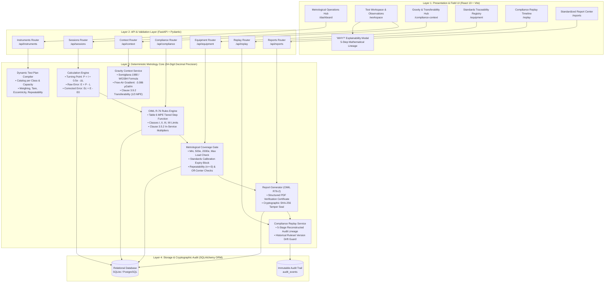

# CALIBRA — System Architecture

## System Architecture Diagram

## Layer Responsibilities
1. **Frontend**: Pure reactive UI for technicians, auditors, and reviewers. Handles real-time input normalization, visual indicators, explainability modal, and the Metrological Operations Hub.
2. **Backend API**: FastAPI REST endpoints with strict Pydantic schemas, role-based access checking, and JSON serialization.
3. **Compliance Engine**: Metrology core utilizing Python `Decimal` (34 digits of precision). Completely isolated from AI to guarantee 100% deterministic reproducibility.
4. **Storage & Cryptographic Audit**: Immutable SQLite/PostgreSQL relational database with SHA-256 checksum verification on all generated reports.
