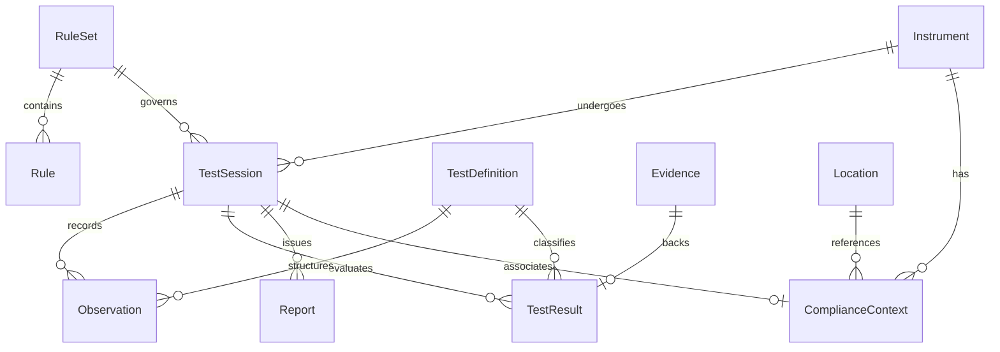

# CALIBRA — Database Schema & Architecture

CALIBRA uses SQLAlchemy ORM with native support for **SQLite** (for zero-configuration development, local edge verification, and automated testing) and **PostgreSQL** (for enterprise multi-tenant laboratory deployments).

---

## Entity Relationship Summary

---

## Core Entities

### 1. `instruments`
Stores physical and legal instrument attributes.
- `id`: Primary key
- `manufacturer`: e.g. "Mettler Toledo"
- `model`: e.g. "bC-U2 Commercial Scale"
- `serial_number`: Unique manufacturer serial
- `accuracy_class`: "I", "II", "III", "IIII"
- `min_capacity`: Minimum legal capacity (Min)
- `max_capacity`: Maximum capacity (Max)
- `verification_interval_e`: Verification interval in grams ($e$)
- `scale_interval_d`: Actual display scale interval ($d$)
- `has_internal_calibration`: Boolean (True if automatic self-calibrating weight installed)
- `is_gravity_sensitive`: Boolean (True if load cell/spring dependent on local $g$)
- `test_location`: Name of initial verification facility
- `intended_location`: Destination facility for operational use

### 2. `compliance_contexts`
Preserves geographical and environmental testing conditions.
- `id`: Primary key
- `instrument_id`: Foreign key to `instruments`
- `test_session_id`: Foreign key to `test_sessions`
- `test_location`: Origin testing site
- `intended_location`: Operating destination site
- `latitude`, `longitude`, `elevation`: Geographic coordinates
- `local_gravity`: Acceleration in $\text{m/s}^2$
- `gravity_source`: "DECLARED", "MEASURED", "ESTIMATED"
- `temperature_c`, `humidity_pct`: Ambient test room parameters
- `is_transferable`: Boolean
- `transferability_status`: "TRANSFERABLE", "CONDITIONAL", "RE_TEST_REQUIRED"
- `transferability_reason`: Deterministic OIML R76 rationale

### 3. `test_equipment`
Tracks laboratory reference mass standards and weights sets.
- `equipment_id`: Unique identifier (e.g. `EQ-F1-002`)
- `name`: Description of standard weights
- `class_standard`: "E2", "F1", "F2", "M1"
- `calibration_date`: Datetime of calibration
- `calibration_expiry`: Datetime of expiration (checked by CoverageGate)
- `certificate_number`: Traceable calibration certificate
- `status`: "VALID", "EXPIRED", "MAINTENANCE"

### 4. `reports`
Maintains immutable finalized OIML R76-2 reports.
- `id`: Primary key
- `session_id`: Foreign key to `test_sessions`
- `report_number`: e.g. `CALIBRA-R76-0001-REV1`
- `revision`: Integer (increments on amended reports)
- `ruleset_version`: Stored standard edition
- `calculation_version`: Algorithm version hash
- `status`: "FINAL", "DRAFT", "AMENDED"
- `checksum_sha256`: Cryptographic hash of the physical PDF
- `pdf_path`: Storage location
